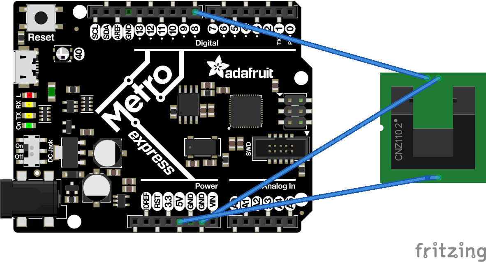

# Circuitpython
My Circuit Python assignments
All of my Circuit Python assignments so far

# Assignments

## Circuitpython Hello Circuitpython(and metro and mu)
##### Objective
This assignment taught us the basics of Circuitpython. We made our neopixel red. by assigning RGB values (Links to an external site.) using the fill() function. Then we had to get an led to fade.
# What you had to learn
We learned what RGB values are, and the basic terms for coding since this is a different language that the one we used for arduino. we learned how to change the neopixel red by assigning RGB values (Links to an external site.) using the fill() function. we learned how to name and save assignments. then the code for getting an led to fade was simular to what we knew we just had to get used to the formating, and the language overall because certain parts were different. 

##### Code
    
    def world():
     print("Hello, World!")

    import board
    import digitalio
    import pulseio
    from digitalio import DigitalInOut, Direction
    pwm_leds = board.D0
    pwm = pulseio.PWMOut(pwm_leds, frequency=1000, duty_cycle=0)

    led = digitalio.DigitalInOut(board.A1)
    led.direction = digitalio.Direction.OUTPUT
     brightness = 0
    fade_amount = 1285
    counter = 0

    while True:

     pwm.duty_cycle = brightness

    brightness = brightness + fade_amount

    print(brightness)
    if brightness <= 0:
        fade_amount = -fade_amount
        counter += 1
    elif brightness >= 65535:
        fade_amount = -fade_amount
        counter += 1

    digital_leds.value = True
    time.sleep(.015)
     digital_leds.value = False
     time.sleep(.015)

    import pulseio
    import board
    import analogio

    led = analogio.AnalogOut(board.A0)
    brightness = 40000
    fadeAmount = 10

    import time

    while True:
        led.value = brightness
        brightness = brightness + fadeAmount

    if brightness <= 40000 or brightness >= 65000:
      fadeAmount = -fadeAmount
# Circuitpython Servo
##### Objective
to get a servo are to rotate 180 degrees when pressed and only moving when the button is pressed.
##### What you had to learn
What a PWM is and how to use it. The pin process is about the same as what we knew and the code itself, is very similar to the code used last year, it just took some monevering.

##### Code
    
    import time
    import board
    import pulseio
    from adafruit_motor import servo
    import touchio

    touch_pin1 = touchio.TouchIn(board.A1)
    print(touch_pin1.value)
    touch_pin2 = touchio.TouchIn(board.A4)
    print(touch_pin2.value)

    pwm = pulseio.PWMOut(board.A3, duty_cycle=2 ** 15, frequency=50)

    my_servo = servo.Servo(pwm)

    my_servo.angle = 90
    while True:
       if touch_pin1.value:
             if my_servo.angle >=2:
                my_servo.angle -= 1
                time.sleep(0.01)

       if touch_pin2.value:
             if my_servo.angle <=179:
                my_servo.angle += 1
                time.sleep(0.01)
# Circuitpython LCD
##### Objective
to get a counter on a LCD to count the amount of presses of a button.
#what you had to learn
Now this project took me forever. getting the counter placement was hard. after reaching 10, it would keep the 0 or it would move over a space and start printing there. It took printing some spaces for the LCD to show the counts.

##### Code

    import time
    import board
    import digitalio

    from lcd.lcd import LCD
    from lcd.i2c_pcf8574_interface import I2CPCF8574Interface

    button_a = digitalio.DigitalInOut(board.D2)
    button_a.direction = digitalio.Direction.INPUT
    button_a.pull = digitalio.Pull.UP

    switch = digitalio.DigitalInOut(board.D8)
    switch.direction = digitalio.Direction.INPUT
    switch.pull = digitalio.Pull.UP

    from lcd.lcd import CursorMode

    lcd = LCD(I2CPCF8574Interface(0x27), num_rows=4, num_cols=20)

    lcd.clear()

    lcd.set_cursor_pos(0,0)
    lcd.print("Button presses")

    lcd.set_cursor_mode(CursorMode.LINE)
    presses = 0
    lastbutton = True
    while True:
        lcd.set_cursor_pos(1,0)
        print(button_a.value)
        time.sleep(.05)
        if not button_a.value and switch.value and lastbutton:
            presses = presses + 1
            lcd.print(str(presses  ))
            lcd.print("      ")
        if not button_a.value and not switch.value and lastbutton:
            presses = presses - 1
            lcd.print(str(presses  ))
            lcd.print("      ")
        lastbutton = button_a.value
    
# Circuitpython Photointerrupters
##### Objective
Wire up your photointerrupter and have it keep track of how many times it has been interrupted.
Your program outputs the count using a full sentence like "The number of interrupts is: ___" or "I have been interrupted ___ times."
The program outputs the sentence every 4 seconds.
Don't use sleep(). 

##### What you had to learn
You had to learn how to make it print the counts in the servo monitor every 4 seconds without time sleep().

##### Code

    import time
    import board
    import digitalio

    switch = digitalio.DigitalInOut(board.D8)
    switch.direction = digitalio.Direction.INPUT
    switch.pull = digitalio.Pull.UP

    interruptcount = 0
    lastbutton = True
    while True:
         print("the number of the interrupts is")
         time.sleep(4)
         if switch.value:
             interruptcount = interruptcount + 1
             print(str(interruptcount  ))
    photoIndicate = photo.value

# Circuitpython Distance Sensor
##### Objective
to get the neopixel to go through a rainbow when you move your hand over an ultrasonic sensor. for different distances it would go to the different colors in the rainbow.
##### What you had to learn
we had to combine the first assignment with our past knowledge of a servo. we had to use rgb values for the colors and we had ro know what order to put the corresponding numbers for a color to make them go in rainbow order and, for certain colors, blend them.

##### Code
     
     import time
      import board
      import adafruit_hcsr04
      import board
      import neopixel
      from simpleio import map_range

      dot = neopixel.NeoPixel(board.NEOPIXEL, 1)

      sonar = adafruit_hcsr04.HCSR04(trigger_pin=board.D4, echo_pin=board.D5)

      while True:
          try:
              distance = sonar.distance
              #print((distance,))
              if distance <= 20:
                  r = map_range(distance,0,20,255,0)
                  b = map_range(distance,0,20,0,255)
                  print(r)
                  dot.fill((int(r),0,int(b)))
              #elif distance >= 20:
                 # r = map_range(distance,10,30,255,0)
                #  print(r)
                 # dot.fill((0,int(r),0))
              else:
                  b = map_range(distance,20,35,255,0)
                  g = map_range(distance,20,35,0,255)
                  print(r)
                  dot.fill((0,int(g),int(b)))
          except RuntimeError:
              print("Retrying")
          time.sleep(0.1)

# Circuitpython classes, objects, and modules
##### Objective
To use a class, object, and module to create a new library designed to make working with RGB LEDs easier.
##### What you had to learn
We had to learn what a class, object and module were, then apply them to an assignment. we had to learn how to wire an RGB and use the different pins that respond to a color light up.

##### Code
 The main:
        
        import time
        import board
    from rgb import RGB   # import the RGB class from the rgb module

    r1 = board.D3
    g1 = board.D4
    b1 = board.D5
    r2 = board.D7
    g2 = board.D2
    b2 = board.D1

    myRGB1 = RGB(r1,g1,b1)   # create a new RGB object, using pins 3, 4, and 5
    myRGB2 = RGB(r2,g2,b2)   # create a new RGB object, using pins 8, 9, and 10

    myRGB1.red()          # Glow red
    myRGB2.green()        # Glow green
    time.sleep(1)
    myRGB1.blue()         # Glow blue
    myRGB2.cyan()         # Glow... you get it...
    time.sleep(1)
    myRGB1.magenta()      # Did you know magenta isn't in the rainbow?
    myRGB2.yellow()       # Like you learned in first grade, red and green make... huh?
    time.sleep(1)
    # extra spicy (optional) part
    myRGB1.rainbow(rate1) # Fade through the colors of the rainbow at the given rate.  Oooooh, pretty!
    myRGB2.rainbow(rate2) # Fade through the colors of the rainbow at the given rate.  Oooooh, pretty!
    time.sleep(1)

    The class:
    import pulseio
    import simpleio
    import time

    class RGB
     kind = "color"

    def __init__(self, r, g, b):
        self.r = pulseio.PWMOut(r, duty_cycle=0, frequency=1000)
        self.g = pulseio.PWMOut(g, duty_cycle=0, frequency=1000)
        self.b = pulseio.PWMOut(b, duty_cycle=0, frequency=1000)

    def addTrick(self, trick):
        self.tricks.append(trick)

    def red(self):
        print("red")
        self.r.duty_cycle = 2 ** 16-1
        self.b.duty_cycle = 0
        self.g.duty_cycle = 0

    def green(self):
        print("green")
        self.r.duty_cycle = 0
        self.b.duty_cycle = 0
        self.g.duty_cycle = 2 ** 16-1

    def blue(self):
        print("blue")
        self.r.duty_cycle = 0
        self.b.duty_cycle = 2 ** 16-1
        self.g.duty_cycle = 0
    def magenta(self):
            print("magenta")
        self.r.duty_cycle = 0
        self.b.duty_cycle = 0
        self.g.duty_cycle = 2 ** 16-1

    def cyan(self):
            print("cyan")
        self.r.duty_cycle = 2 ** 16-1
        self.b.duty_cycle = 0
        self.g.duty_cycle = 0

    def yellow(self):
            print("yellow")
        self.r.duty_cycle = 0
        self.b.duty_cycle = 2 ** 16-1
        self.g.duty_cycle = 0

    def rainbow1(self):
        rate=128
        for i in range (0, 2 ** 16, rate):
            self.r.duty_cycle = 0+i
            self.b.duty_cycle = 2 ** 16-1-i
            self.g.duty_cycle = 2 ** 16-1
        for i in range (0, 2 ** 16, rate):
            self.r.duty_cycle = 2 ** 16-1
            self.b.duty_cycle = 0+i
            self.g.duty_cycle = 2 ** 16-1-i
        for i in range (0, 2 ** 16, rate):
            self.r.duty_cycle = 2 ** 16-1-i
            self.b.duty_cycle = 2 ** 16-1
            self.g.duty_cycle = 0+i
     def rainbow2(self):
        rate= 64
        for i in range (0, 2 ** 16, rate):
            self.r.duty_cycle = 0+i
            self.b.duty_cycle = 2 ** 16-1-i
            self.g.duty_cycle = 2 ** 16-1
        for i in range (0, 2 ** 16, rate):
            self.r.duty_cycle = 2 ** 16-1
            self.b.duty_cycle = 0+i
            self.g.duty_cycle = 2 ** 16-1-i
        for i in range (0, 2 ** 16, rate):
            self.r.duty_cycle = 2 ** 16-1-i
            self.b.duty_cycle = 2 ** 16-1
            self.g.duty_cycle = 0+i
# Hello VS Code
##### Objective
To get vs set up and then for it to print something.
##### What you had to learn
Hw VS works, how it connects to github and putting all of your code into GitHub, then the coding was simple, same as what we did in Circuitpython.
##### Code
import board 
import time

    while True: 
        print("it works")
        time.sleep(.1)

# FancyLED
##### Objective
To use 6 LEDs and for them to show alternating, sparkle, and blinking. We used a class for our main code to import.

##### What you had to learn
This one was quite simple because is was very similar to the rbg assignment. Instead of the colors changing you were just changing the action of the led.

##### Code
    
    import board #pylint: disable-msg=import-error
    import random 
    import digitalio #pylint: disable-msg=import-error
    #import simpleio #pylint: disable-msg=import-error
     import time 

    class fancyled:
         kind = "color" # class variable shared by all instances

     # you don't need an __init__ method, but it is common for stuff that runs at instantiaion
   
     def __init__ (self, p1, p2, p3):
        self.fancy1 = digitalio.DigitalInOut(p1) #sets temp values for p1/2/3
        self.fancy2 = digitalio.DigitalInOut(p2)
        self.fancy3 = digitalio.DigitalInOut(p3)
        self.fancy1.direction = digitalio.Direction.OUTPUT #defines them as outputs
        self.fancy2.direction = digitalio.Direction.OUTPUT
        self.fancy3.direction = digitalio.Direction.OUTPUT
     def alternate(self):
        print("alternate") #runs alternate function
        self.fancy1.value = True
        self.fancy2.value = False
        self.fancy3.value = True
        time.sleep(.15)
        self.fancy1.value = False
        self.fancy2.value = True
        self.fancy3.value = False
        time.sleep(.15)
     def blink(self): #runs blink function
        print("blink")
        time.sleep(.15)
        self.fancy1.value = False
        self.fancy2.value = False
        self.fancy3.value = False
        time.sleep(.15)
        self.fancy1.value = True
        self.fancy2.value = True
        self.fancy3.value = True
     def chase(self): #runs chase function
        print("chase")
        self.fancy1.value = True
        self.fancy2.value = False
        self.fancy3.value = False
        time.sleep(.15)
        self.fancy1.value = False
        self.fancy2.value = True
        self.fancy3.value = False
        time.sleep(.15)
        self.fancy1.value = False
        self.fancy2.value = False
        self.fancy3.value = True
        time.sleep(.15)
     def sparkle(self): #runs the sparkle function
        print("sparkle")
        rand = random.randrange(4, 10, 1) #randomly selects a pin
        uptime = random.randrange(0, 20, 1)#randomly selects a time
        uptime = uptime/150 #divides time to get a smaller number
       # print(uptime)
        if rand == 4: #run sparkle for each pin with random values
           self.fancy1.value= True
           self.fancy2.value = False
           self.fancy3.value = False
           time.sleep(uptime)
        if rand == 5:
           self.fancy2.value= True
           self.fancy1.value = False
           self.fancy3.value = False
           time.sleep(uptime)
        if rand == 6:
           self.fancy3.value= True
           self.fancy1.value = False
           self.fancy2.value = False
           time.sleep(uptime)
        if rand > 6:
           self.fancy1.value = False
           self.fancy2.value = False
           self.fancy3.value = False
           time.sleep(uptime)

